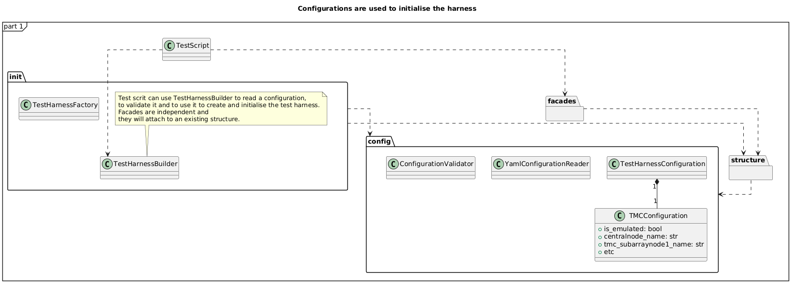
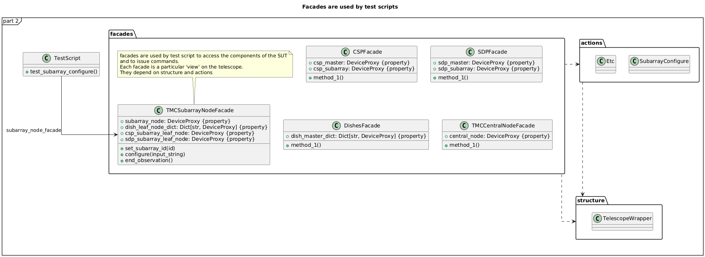
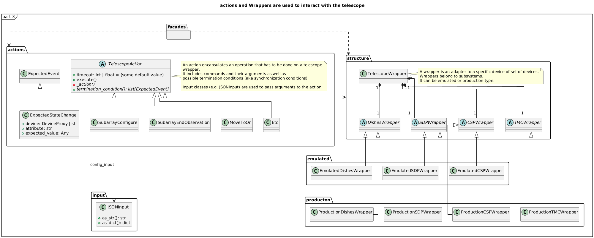

Architecture overview of the SKA Integration Test Harness
=========================================================

This document provides an overview of the architecture of the SKA
Integration Test Harness and the principles behind it. It is
written as a high-level document on purpose, to provide a general understanding of
the design decisions and the conventions used in the test harness, more
than a detailed description of the code.

Since the test harness is still in development, both the code and the
design may change in the future. The overall principles, however, will
likely remain the same.

This document is updated the last time in October 2024.

What glues the test scripts to the SUT?
----------------------------------------

This test harness is code that glues integration test scripts to the
SUT. It is designed to provide a consistent interface for all tests, to
be **powerful** (allowing for complex tests), to be **flexible**
(extensible to meet the needs of different SUTs and different tests), to
be **easy to use** (so that tests can be written quickly), to be **easy
to maintain** (so that tests and the harness itself can be updated quickly)
and **reliable** (so that tests can be trusted).

The test harness is designed to work with SKA subsystems' Tango devices,
specifically to support integration tests where you have one or more SKA
subsystems (e.g., TMC, CSP, etc.) deployed as a production component or as
an emulator. At the moment the test harness is specifically designed to
work with the TMC subsystem, integrated with CSP, SDP and the dishes
(TMC in Mid); in the future, it may be extended to support other
subsystems and other SUT variants.

This test harness comprises:

-  **facades**, aimed at providing a consistent interface to the SUT so
   that test scripts are insulated from internal details
-  **actions**, which are the building blocks of tests and each includes
   a relatively complex action that can be performed on the SUT (like
   sending a command to a device)
-  **wrappers**, which wrap subsystems of the SUT and provide a
   structured interface to them and to their devices, eventually
   providing an abstraction for some operations (e.g., operations that
   may differ between a production device and an emulator)
-  **inputs**, which are used to generate the JSON input data for the
   various commands that are sent to the SUT
-  **configurations**, which are used to gather configuration data or
   flags from the environment and provide a structured interface to them
-  **emulators**, which are real Tango devices whose behaviour is
   programmed to mimic in a very simple way the behaviour of real
   devices. They are needed to ensure that SUT is embedded in the
   environment that it expects.

   -  Currently, emulators are those used in the TMC-Mid integration
      tests
      (`code <https://gitlab.com/ska-telescope/ska-tmc/ska-tmc-common/-/tree/master/src/ska_tmc_common/test_helpers?ref_type=heads>`__,
      `documentation <https://developer.skao.int/projects/ska-tmc-common/en/latest/HelperDevices/TangoHelperDevices.html>`__).
      To use this test harness you have to deploy them in your
      environment and configure the test harness with the right device
      names.

Integration Test Harness principles
-----------------------------------

PRINCIPLE 1: Tests are agnostic to the test environment
~~~~~~~~~~~~~~~~~~~~~~~~~~~~~~~~~~~~~~~~~~~~~~~~~~~~~~~~~~~~

Test scripts should know as little as possible about the test
environments so that the same test, with different configurations, can
be run in different environments (like the cloud, an ITF, a PSI). As a
consequence a test script should interact only with facades, with
wrappers and with inputs: no actions, no configurations. Interaction
with wrappers is needed to write meaningful assertions.

PRINCIPLE 2: Tests are agnostic to the SUT ecosystem
~~~~~~~~~~~~~~~~~~~~~~~~~~~~~~~~~~~~~~~~~~~~~~~~~~~~~~~~~~~~

Integration tests make use of emulators and simulators. In many cases
test scripts can be implemented in such a way that they do not know
which devices are real and which are emulated. In this way, the same
test script can be run with different configurations of real and
emulated devices.

Of course, somewhere one needs to say that a device is emulated and what
should its behaviour be. This is done in the configuration files/flags
and, because emulated devices are de facto Tango devices, they should be
defined, implemented and deployed prior to the execution of the test
script (and hence prior to the execution of the test harness).

In some cases it may be necessary for the test script to make assertions
on emulators (i.e. to use them as `spy objects
<http://xunitpatterns.com/Test%20Spy.html>`__). In these cases
such a test makes the assumption that the device is emulated. By
carefully writing assertions though, and through the use of `tracer
objects <https://developer.skao.int/projects/ska-tango-testing/en/latest/guide/integration/index.html#tracer-objects>`__,
it is possible to write tests that can be run with real devices and
emulators without knowing which is which. See below for examples.

Conventions (where to find the code)
--------------------------------------

Before starting to understand the idea behind each kind of component
in the test harness (facades, actions, wrappers, etc.), it is
useful to know where to find the code.

The test harness files are organized in the following way:

-  Facades have to be added in the 
   :py:mod:`~ska_integration_test_harness.facades` folder
-  Actions have to be added in the
   :py:mod:`~ska_integration_test_harness.actions` folder
-  Abstract definitions of the wrappers have to be added in the
   :py:mod:`~ska_integration_test_harness.structure` folder,
   while :py:mod:`~ska_integration_test_harness.emulated`
   and :py:mod:`~ska_integration_test_harness.production`
   folders contains respectively the concrete implementations of the
   wrappers for the emulated and production subsystems.
-  Input-related classes have to be added in the
   :py:mod:`~ska_integration_test_harness.inputs` folder
-  configuration-related classes have to be added in the
   :py:mod:`~ska_integration_test_harness.config` folder
-  The :py:mod:`~ska_integration_test_harness.init` folder
   contains all the factories needed to initialise the test harness.

The top-level ``tests`` folder contains the unit tests for the harness
itself.

Design decisions
----------------

Why use facades?
~~~~~~~~~~~~~~~~~~

As mentioned above we want an high-level way to represent the SUT, its
subsystems, its devices and the operations that can be performed
against them. To achieve this, we use **Facades**.

Facades are classes that provide a simplified interface to a complex system;
in this case, the complex system is the combination of the telescope
subsystems and the test harness internal logic itself. 

Concretely, we define a facade for each subsystem of the telescope
(e.g., TMC, CSP, DSH, etc.) and we make it expose: 

-  the devices that are part of the subsystem;
-  the operations that can be performed on the subsystem (like sending
   a command, or something more complex like moving the subsystem to a
   certain state passing through a sequence of commands).

When writing a test script, the test script will interact with the facade
to access the devices and subscribe to their events and will use the
facade to perform operations on the subsystem. The two main advantages
of using facades are the following:

1. they are a semantic-oriented way to represent the SUT
   and its subsystems and they can be used encode structured interface
   to something that is a bit more complex than a single Tango device;

2. they permit you to hide some technical details about
   the interaction with the devices, especially if there are set-up or
   tear-down interactions which are not the main point of the test.

Let's see the advantages through the following example: you have to
test the capability of TMC integrated with the other subsystems (production
or emulated) to perform a scan.

- **Use in the "GIVEN" steps**: first of all, you have to be in a 
  state where the TMC is ``READY`` to start the scan. To do so, instead of
  calling all the Tango commands by yourself and synchronizing explicitly
  (producing this way a lot of boilerplate code which is not the main
  point of the test), you can use a single line of code
  that moves the TMC to the ``READY`` state, dealing transparently with
  the synchronization.

- **Use in the "WHEN" steps**: after you setup the desired condition,
  you have to send the ``Scan`` command to the TMC. To do so you can, again, 
  use the facade method. This way,
  if in future the ``Scan`` command changes, the dependencies
  will be more explicit and you will have less code to change.

- **Use in the "THEN" steps**: finally, you have to check that the scan
  has been performed correctly and all the involved subsystems are in
  the expected state. Through the various facades you can access in a 
  structured way to the devices to:

  - subscribe to the events (*before calling the command*);
  - assert that events have happened (*after calling the command*);
  - eventually, assert that the properties of the devices are as expected (*after
    calling the command*).

  If something changes in the configuration (e.g., the device names),
  you will have to update only a configuration file instead of all the
  references to various device names around your code.

The choice of having a different facade for each subsystem
favours the separation of concerns and is a way to avoid bloating a
single "Test Harness" class with too much unrelated functionality
and too many responsibilities (see `Single Responsibility Principle 
<https://en.wikipedia.org/wiki/Single-responsibility_principle>`__).

The 
`Facade <https://refactoring.guru/design-patterns/facade>`__
is also a well known design pattern, whose
core idea is to provide a simplified interface to a complex system. 
In this case the complex system is the test harness itself, with all its
internal mechanisms that sometimes may be too technical to be exposed in
the test scripts.

Facade-based design is visually represented in the following UML diagram.

|facades|

Why use actions?
~~~~~~~~~~~~~~~~~~

The general idea of the **actions** is - in brief - to encode an operation
you perform on the telescope in a single class. One may ask, why not
just a single method in a facade or a wrapper? Or also, why not
just directly call Tango commands from the test script? Here there follow
some reasons.

First of all, a test script has to interact with the SUT and its subsystems
and it does that by sending Tango commands on devices. Even if apparently
having a class just to send a command may seem like overkill, in reality
there are a lot of complexities that justifies the existence of actions:

- the commands have to be called in on the right device;
- the commands require the right input;
- since the telescope is a distributed system, most command calls are
  asynchronous and the test script has to synchronize with the devices;
- in a more general sense, when performing an operation (in your GIVEN steps)
  you may want to synchronize on a desired transient or quiescent state
- very often, the operations implicitly involve devices that are part of
  different subsystems, so the synchronization may need to involve them all;
- if something changes about the command (e.g., the name, the input,
  the expected events, the expected state of the devices), you may want to
  update only in one place and have all the dependencies as much explicit
  as possible;
- you may want to automatically log the operations you run and their results
  in a transparent way.

Moreover, in the context of the testing of the telescope, not all the
operations are just a single command but:

- sometimes you may want to build and call a sequence of operations;
- sometimes an operation is simply more sophisticated than a simple command
  call and additional logic is needed.

All these reasons justify the existence of actions as structured entities
to encapsulate the complexity of the operations that are performed on
the telescope. The actions are represented through classes
that embed both the *code to perform the operation* and *the
termination/synchronization condition*. 
All the action classes extend a common base class
(:py:class:`~ska_integration_test_harness.actions.TelescopeAction`)
and implement as abstract methods the procedure to perform the action
and the condition to synchronize at the end of the action (if needed).
From the base class they inherit:

- the logic to execute the action;
- the logic to log the action (if needed);
- the logic to synchronize at the end of the action (if needed);
- the fact of having a target (the wrappers - *see next section*);
- properties like a name, the timeout, etc.

At the moment, the actions are generally called by facades (or by other
actions, or by wrappers specific implementations) and they are used to
perform the operations that are needed to
be done on the telescope. For example, let’s consider a
test script that wants to send a scan ``Scan``
command to the TMC Subarray Node:

-  the test script has access to a
   facade of the TMC Subarray Node (see :doc:`./getting_started` for
   more details on how to use a facade);
-  the facade exposes a ``scan()`` method, which can be called by the
   tests;
-  the ``scan()`` method which instantiates an action called
   ``SubarrayScan``, adds to it the necessary arguments and then calls
   its ``execute`` method;
-  who implemented the class, defined all the related logic to send the
   scan command and - *optionally* - synchronize at the end of the scan
   operation in the same place (implementing two abstract methods);
-  the actions interact with the correct wrappers (and consequently to
   the Tango devices) to perform the operation.

Actions general idea is based on the
`Command <https://refactoring.guru/design-patterns/command>`__ design pattern
and make heavy use of
`Template Method <https://refactoring.guru/design-patterns/template-method>`__.
A a sequence of actions is also a design pattern, since it is implemented
through `Composite <https://refactoring.guru/design-patterns/composite>`__.

To implement an action, you have to extend the
:py:class:`~ska_integration_test_harness.actions.TelescopeAction`
base class and implement the abstract methods (to define the *procedure* that
implements the action and the *synchronization condition* that defines
when the action is completed). Note also that actions can be composed in
sequences, to perform more complex operations (see
:py:class:`~ska_integration_test_harness.actions.TelescopeActionSequence`
). Note also that actions can also be defined
as a complex inheritance hierarchy, to define common behaviours and to
specialize them (see how the existing actions are
implemented).

The actions mechanism is represented (high level) in the following UML.

|actions|

Why use wrappers? (and differences from facades)
~~~~~~~~~~~~~~~~~~~~~~~~~~~~~~~~~~~~~~~~~~~~~~~~

In the Integration Test Harness, the **wrappers** can be seen as the
way we *internally* use to represent the SUT (a telescope), it's
subsystems and the devices. Concretely, the wrappers are classes that:

- encode the structure of the SUT (i.e. which subsystems are part of it
  and which devices are part of each subsystem);
- support the performing of "technical actions" on the devices (like
  the tear-down to a "base state", the logging of the device versions,
  etc.);
- encapsulate the technical details related to the *emulated* or *production*
  status of the devices (permitting to abstract from that from the test
  scripts and from the actions);
- support a certain level of configuration.

The main access point to the wrappers is a class called
:py:class:`~ska_integration_test_harness.structure.TelescopeWrapper`,
which is intended to represent the entire SUT and internally holds
references to all the subsystem wrappers. Since the SUT is one, the
telescope wrapper is a
`Singleton <https://refactoring.guru/design-patterns/singleton>`__,
so once it’s initialised, you can access it from everywhere in the code
just by accessing its unique instance. The subsystem wrappers are
instead dedicated abstract classes, which may have a "production" and an
"emulated" concrete implementation. Each subsystem extends a common base
abstract class (which provides a common interface for some recurrent
operations) and, usually, supports a specific configuration.

**What is the difference between a facade and a wrapper?**

A doubt that may arise is: why do we need both facades and wrappers? The doubt
is legitimate, since they both represent the SUT, they both have classes
for the subsystems and they both have references to the devices. Despite that,
the choice of having both is not casual and is based on the fact that, even
if they represent the same thing, they are used in different contexts and
for different purposes.

- The facades are used in the test scripts to provide a high-level interface
  to the SUT. They are mean to be 100% agnostic to technical details and
  instead they are focused on exposing the operations (meaningful to the business)
  that can be performed on the SUT and the devices that are part of it.

- The wrappers instead are the opposite, they are an internal
  technical representation of the SUT, which may include details
  which are not related to the business logic of the test script
  (like, the fact something may be production or emulated, technical
  initialisation and tear-down procedures, etc.).

Moreover, the existence of the wrappers as separate entities from the
facades is justified also by the Actions mechanism. As we already said in the
previous section, the actions are classes that perform operations on
the telescope and such operations need to be performed on a target. If the
target is a facade, we would have two problems:

- circular dependencies, since the facades are also the ones that instantiate
  the specific actions;
- the actions occasionally need to access something more "internal" and
  technical (e.g., a method that differentiates between production and
  emulated devices) and exposing that in the facade would make them
  be less business-oriented.

In other words, the wrappers are the internal representation of the SUT
which permits the more external representation (the facades) to be
more business-oriented and high-level.

Why use a JSON data builder?
~~~~~~~~~~~~~~~~~~~~~~~~~~~~

Some actions on the telescope (such as the *scan*, *configure*,
*assign resources* commands) require an input argument that is a JSON
string. Also some *reset* procedures require default arguments to be
used to call the various commands.

Passing these arguments around as strings or dictionaries is not a good
practice, because it makes the code more technical (full of type
conversions, explicit file reading, etc.) and so less readable. The idea
of argument factories is to provide a structured object-oriented
representation of those arguments.

An abstract base class (``JSONInput``) defines what is expected from a
JSON input (return a string or a dictionary, create a copy of itself
with some values changed, etc.). Through a concrete implementation of
this class, one can specify how to generate this JSON (e.g., accessing
your own test data folders, associating keywords to each or your
specific input, through a hardcoded dictionary, etc.). A few
ready-to-use implementations are provided in the ``inputs`` folder.

We chose to use this infrastructure because a JSON input, normally, can
be represented in many ways (a string, a dictionary, a reference to a
file, etc.) and we want a consistent way to represent it in the test
harness context. Moreover, sometimes we want to be able to deal with
guaranteed and validated input (e.g., when we set the initial default
input), sometimes we want to explicitly handle the case of invalid
input (e.g., for unhappy paths tests) and sometimes we want to just
ignore that (an action that just sends a commands wants to deal the same
way with valid and invalid input).

The main inspiration behind this mechanism is the 
`Factory Method <https://refactoring.guru/design-patterns/factory-method>`__
design pattern,
`Abstract Factory <https://refactoring.guru/design-patterns/abstract-factory>`__
and `Builder <https://refactoring.guru/design-patterns/builder>`__ are
indirect inspirations too.

In ``inputs`` folder you can find some examples of JSON input classes,
but also other input-output related classes. One of the most important
is the ``TestHarnessInputs`` class, which is a structured representation
of the input data needed to initialise the test harness (and sometimes
to do other operations). This class is used by the initialisation
procedures to load and validate the JSON input for the commands used in
the teardown procedures.

Why use configuration classes?
~~~~~~~~~~~~~~~~~~~~~~~~~~~~~~~~

These are mechanisms that collect configuration data from files or
runtime flags, represent them in objects, and support fixtures to setup
the proper instances of the test harness.

The test harness to be initialised needs a lot of configuration data, such as:

- the names of the devices that are part of the subsystems;
- the flags that tell what is emulated and what is production.

To give structure to this data and to provide a consistent interface to
it, we use configuration classes. Generally, foreach subsystem we want
to have a configuration class that represents the configuration data
needed to initialise the subsystem (e.g., for the TMC configuration
we have a
:py:class:`~ska_integration_test_harness.config.TMCConfiguration`
class). All subsystems configuration are then collected in a common class
(:py:class:`~ska_integration_test_harness.config.TestHarnessConfiguration`)
which serves as entry point to the configuration.

This configuration instance can be filled in programmatically and passed to
the test harness initialisation procedures, or - more commonly - can be
loaded from a YAML file. A configuration can also be validated, to ensure
that all the required fields are set, the given devices are reachable, etc.

The configuration reading, validation and the test harness setup mechanisms
are visually represented in the following UML diagram.

|configurations|

Currently, the main representation of the configuration is through YAML
files. An example of valid configuration file is provided in
:ref:`configuration_example`. 

Why have an initialisation procedure?
~~~~~~~~~~~~~~~~~~~~~~~~~~~~~~~~~~~~~~~

A complete test harness can be - potentially - set up just by creating a
telescope wrapper instance and initialising it with subsystem wrappers
(properly initialised with configuration classes and input). Since this
can be a quite complex and error prone procedure,
a default initialisation procedure is encoded in a builder class, which:

-  reads the configuration from a YAML file;
-  validates it (checking all required fields and sections are set, that
   the device names point to existing and reachable Tango devices,
   etc.);
-  collects the default input;
-  validates it;
-  uses the input and the configuration to create the instances of the
   wrappers.

To do each of those steps, the builder uses a set of classes that
potentially can be extended to support custom initialisation procedures.

The initialisation procedure makes heavy use of the
`Abstract Factory <https://refactoring.guru/design-patterns/abstract-factory>`__
and `Builder <https://refactoring.guru/design-patterns/builder>`__
design patterns. In a certain sense, then the various internal tools are
`Strategies <https://refactoring.guru/design-patterns/strategy>`__ used
by the builder to compose the test harness.

Other tools
~~~~~~~~~~~

The test harness also provides tools like:

-  an utility class to connect to the
   `ska-k8s-config-exporter <https://gitlab.com/ska-telescope/ska-k8s-config-exporter>`__
   service and get the versions of the Tango devices running in the
   Kubernetes namespace where the devices are deployed.

.. (the source code of these diagrams is in ``*.plantuml`` and can be
.. updated with ``java -jar plantuml.jar *.plantuml``; likewise for the
.. other diagrams, or use the attached Makefile and do
.. ``make update-diagrams`` while being in the diagrams folder).

