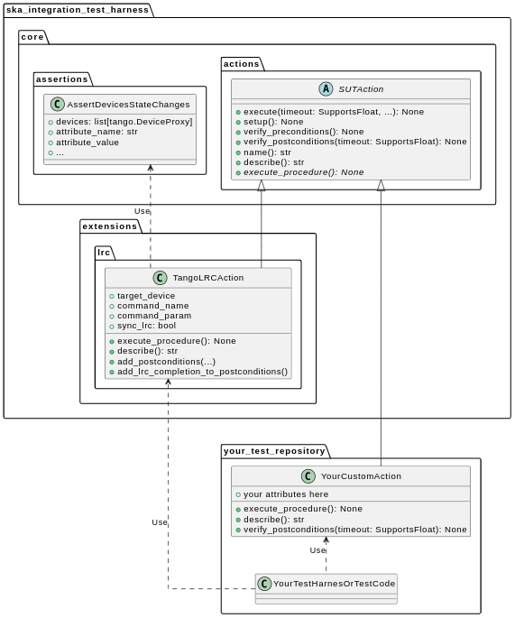

Actions, Assertions and Synchronisation
-------------------------------------------

Conceptual definition
^^^^^^^^^^^^^^^^^^^^^^^^^^

The first logical building block to consider is the **Action**. An Action 
is a structured representation of an interaction with the SUT. Concretely, 
it can be any operation you may wish to perform on the SUT, such as sending 
a command, setting an attribute, or orchestrating something more complex.

We assume that most interactions with the SUT, whether simple or complex, 
can be represented as a sequence of the following three +1 steps:

1. The **verification of certain pre-conditions**, which must be satisfied 
   before the action can be executed (e.g., ensuring the SUT is in a 
   specific known state).
2. The **execution of the action procedure** itself 
   (e.g., sending a command, setting an attribute, etc.).
3. The **verification of certain post-conditions**, which are expected to be 
   met following a successful action execution (e.g., confirming the SUT has 
   reached a given target state).

As we are working with distributed systems where interactions are highly 
event-based, post-conditions will typically need to be **verified within 
a timeout**. This is because the SUT may take time to reach the expected 
state, and waiting indefinitely is not practical. In this sense, 
post-condition verification is a form of **synchronisation**.

Additionally, since we are dealing with an event-based system, an action 
may require a **setup** phase to prepare for execution and condition 
verification. This setup phase may involve subscribing to certain events 
or clearing existing events to prevent false positives or negatives in 
verifications, thereby ensuring that the action can be executed multiple times.

Design and implementation
^^^^^^^^^^^^^^^^^^^^^^^^^^

In ITH as a Platform, we provide a base class for actions 
(:py:class:`~ska_integration_test_harness.core.actions.SUTAction`) that 
implements the fundamental structure of an action, including setup, 
pre-conditions, post-conditions, and timeout handling. This base class is 
designed to be extended by custom actions, allowing users to implement 
specific interaction logic for their SUT.

Since some requirements may be common across teams, we also provide 
ready-to-use actions in both the 
:py:mod:`~ska_integration_test_harness.core` layer and the 
:py:mod:`~ska_integration_test_harness.extensions` layer. For example, 
the :py:class:`~ska_integration_test_harness.extensions.lrc.TangoLRCAction` 
is a pre-built action that sends a Tango Long Running Command to a device, 
waits for its completion, and synchronises with certain device state changes.

From your test code (whether in your customisation of the Test Harness or 
within your tests), you can utilise these ready-to-use actions, or you can 
create your own custom actions by extending the base class and implementing 
the necessary extension points.

|ith-platform-actions|

The core logic of actions is implemented in the following modules:

- :py:mod:`ska_integration_test_harness.core.actions`
- :py:mod:`ska_integration_test_harness.core.assertions`

Usage Example 1 (simple): Command + LRC & State Synchronisation
^^^^^^^^^^^^^^^^^^^^^^^^^^^^^^^^^^^^^^^^^^^^^^^^^^^^^^^^^^^^^^^^^^

In this first simple example, we demonstrate how to use the action mechanism
with the provided blocks to execute a basic **Tango command call**, the
subsequent **LRC completion check**, and the **state synchronisation**.

Assume we have a Tango device and want to send it a command. Also, assume
that the command 1) is a Long Running Command (LRC) and 2) will cause the
state of some other devices to change to a particular state. Suppose we want
to ensure that the command executes correctly (without errors) and that the
desired states are reached. To achieve this, we proceed as follows:

1. Define the command as an instance of
   :py:class:`ska_integration_test_harness.extensions.lrc.TangoLRCAction`.
2. Define a pre-condition using an instance of
   :py:class:`ska_integration_test_harness.core.assertions.AssertDevicesAreInState`
   to verify the initial state of the devices and ensure the action executes
   from a valid initial state.
3. Define the expected state transitions as post-conditions using instances
   of :py:class:`ska_integration_test_harness.core.assertions.AssertDevicesStateChanges`.
4. Add directives to impose a timeout, synchronise LRC completion, and fail
   early if an LRC error is detected.
5. Finally, execute the enriched action object with all the directives applied.

.. code-block:: python

    import tango
    import json

    from ska_integration_test_harness.extensions.lrc import TangoLRCAction

    from ska_integration_test_harness.core.assertions import (
        AssertDevicesAreInState, AssertDevicesStateChanges, 
    )
    from <...> import ObsState

    # The device where the command will be sent
    target_device = tango.DeviceProxy("tmc-low/centralnode/0")

    # The devices expected to change state as a result of the command
    subarray_devices = [
        tango.DeviceProxy("tmc-low/subarray/01"),
        tango.DeviceProxy("csp-low/subarray/01"),
        tango.DeviceProxy("sdp-low/subarray/01"),
        tango.DeviceProxy("mccs/subarray/01"),
    ]

    # 1. Create an instance of an action that sends a command to a device
    action = TangoLRCAction(
        target_device=target_device,
        command_name="AssignResources",
        command_param=json.read("low/input/assign_resources.json"),
    )

    # 2. Use pre-conditions to specify the expected initial state
    # for the action to execute successfully. This is optional and
    # often unnecessary, except for ensuring "stronger" tests.
    action.add_preconditions(
        # Expect the devices to be in the EMPTY state
        AssertDevicesAreInState(
            devices=subarray_devices,
            attribute_name="obsState",
            attribute_value=ObsState.EMPTY,
        ),
    )

    # 3. Use post-conditions to specify the expected state changes
    # after the action executes.
    action.add_postconditions(
        # Expect a state change in the devices to the RESOURCING state
        AssertDevicesStateChanges(
            devices=subarray_devices,
            attribute_name="obsState",
            attribute_value=ObsState.RESOURCING,
        ),
        # Expect a state change in the devices to the IDLE state
        AssertDevicesStateChanges(
            devices=subarray_devices,
            attribute_name="obsState",
            attribute_value=ObsState.IDLE,
            previous_value=ObsState.RESOURCING,
        ),
    )

    # 4. Add directives to synchronise LRC completion, fail early on LRC
    # errors, and set a timeout for the action.
    action.add_lrc_completion_to_postconditions()
    action.add_lrc_errors_to_early_stop()

    # 5. Execute the action (within a timeout)
    action.execute(postconditions_timeout=30)

Some further comments on this code:

- The pre-conditions are verified before the command is called. If they fail,
  an ``AssertionError`` is raised, and the command will not be called.
- The post-conditions are verified after the command is called. They are
  verified in the order they are added, and if one fails, subsequent ones
  are not checked. Verification is performed using a
  :py:class:`~ska_tango_testing.integration.TangoEventTracer` to subscribe to
  events and check state changes through assertions.
- The timeout specifies the maximum wait time for post-conditions to be
  verified. It does not affect pre-conditions or the command call.
- The LRC completion check is a post-condition. It is verified after the
  command is called and after other post-conditions are checked, all within
  the same timeout. You can specify which result codes count as successful
  completions. Verification subscribes to the ``longRunningCommandResult``
  state change event and checks the result code for the stored LRC ID.
- The LRC error acts as a "sentinel," monitoring events and halting
  post-condition verification early if an error is detected. You can specify
  which result codes are treated as errors. If an error is detected, an
  ``AssertionError`` is raised, stopping verification before the timeout.
- Synchronisation is managed internally by the
  :py:class:`ska_tango_testing.integration.TangoEventTracer`. All
  subscriptions and event resets are handled automatically, including storing
  the LRC ID.
- Provided the pre-conditions are satisfied, an action can be executed
  multiple times. Post-condition tracking and timeouts are reset with each
  execution.

In summary, the possible outcomes of an action execution are as follows:

1. Pre-conditions and post-conditions (including LRC completion) are satisfied:
   The action is successful.
2. A pre-condition fails: The action procedure (e.g., the command call) is
   not executed, and an ``AssertionError`` is raised.
3. Pre-conditions are satisfied, but some post-condition (including LRC
   completion) fails: The timeout expires, and an ``AssertionError`` is raised.
4. Pre-conditions are satisfied, but an LRC error is detected: An
   ``AssertionError`` is raised before the timeout or all post-conditions
   are verified.
5. Pre-conditions are satisfied, but the action procedure encounters an error
   (e.g., a command call error): The error is uncaptured, and the action fails
   like normal Python code.

**Would you like to try this approach?**
Here are some suggestions for further reading:

- :py:class:`~ska_integration_test_harness.extensions.lrc.TangoLRCAction`
  for details on the action API
- :py:mod:`~ska_integration_test_harness.core.assertions`
  for information on defining pre- and post-conditions, including how to create
  new ones

Usage Example 2 (intermediate): Custom action
^^^^^^^^^^^^^^^^^^^^^^^^^^^^^^^^^^^^^^^^^^^^^^^^^^^^^^^^^^^^^^^^^^

Not all actions are simple command calls, and not all action
synchronisation logic is standard. In this second example, we demonstrate
how to create a custom action that operates on a Tango device attribute to
configure a set of devices to be reachable (and waits for them to become so).

Let us assume we have a controller device that needs to be activated to make
itself and other devices reachable. The controller device has an attribute
``adminMode`` that can be set to ``ONLINE`` to activate the devices. Assume
that to detect the reachability of these devices, we can subscribe to the
``telescopeState`` event and consider the devices reachable when they are in
any of the following states: ``ON``, ``OFF``, or ``STAND_BY``. However, the
subscription must occur **after** the controller device is activated
(otherwise it will not work). Finally, let us say this is a setup procedure
that is prone to failure, so we want to retry it up to 3 times with
exponential timeouts.

To achieve this, we proceed as follows:

1. Define a custom action by subclassing the base class
   :py:class:`ska_integration_test_harness.core.actions.SUTAction`, which
   is essentially an empty shell.
2. Override the ``execute_procedure`` method to implement the custom
   activation logic (in this case, setting the ``adminMode`` attribute).
3. Override the ``verify_postconditions`` method to implement the custom
   synchronisation logic (in this case, subscribing to the event and waiting
   for the devices to be reachable). Also, override the ``setup`` method to
   clean up the event tracer and allow multiple runs.
4. Provide a semantic description of the action (used in failure messages).
5. Create an action instance and run it within a retry loop.

.. code-block:: python

    import tango

    from ska_integration_test_harness.core.actions import SUTAction
    from ska_tango_testing.integration import TangoEventTracer
    from <...> import AdminMode

    # Step 1: Subclass the base class SUTAction to create a custom action
    # from scratch.
    class ActivateSubsystem(SUTAction):
        """Activate a subsystem and ensure it is reachable."""
    

        def __init__(
            self, 
            controller_device: tango.DeviceProxy,
            other_devices: list[tango.DeviceProxy],
            **kwargs
        ):  
            """Initialise the action.

            :param controller_device: The device that must be activated.
            :param other_devices: The devices that must be reachable.
            :param kwargs: Additional parameters. See the base class
                :py:class:`ska_integration_test_harness.core.actions.SUTAction`
                for further details.

            """
            # Always call the super method and pass kwargs. This ensures
            # compatibility with the base class and its required parameters.
            super().__init__(**kwargs)

            self.controller_device = controller_device
            self.other_devices = other_devices
            
            self.tracer = TangoEventTracer()

        # (Pre-conditions are unnecessary here and can be skipped.)

        # ---------------------------------------------------------------------
        # Step 2: Implement the custom activation logic
        def execute_procedure(self):
            self.controller_device.adminMode = AdminMode.ONLINE

        # ---------------------------------------------------------------------
        # Step 3: Implement the custom synchronisation logic (and clean up)

        def verify_postconditions(self, timeout=0):
            # (Always good practice to call the super method)
            super().verify_postconditions()

            # Subscribe to the telescopeState event (deferred; usually
            # done in the setup method)
            self.tracer.subscribe_event(self.controller_device, "telescopeState")
            for device in self.other_devices:
                self.tracer.subscribe_event(device, "telescopeState")

            # Wait for the devices to be reachable
            assertpy_context = assert_that(tracer).described_as(
                self.description() + 
                " The controller device must be reachable."
            ).within_timeout(timeout).has_change_event_occurred(
                self.controller_device, "telescopeState",
                # Define reachability based on these states
                custom_matcher=lambda event: event.attribute_value in [
                    tango.DevState.ON,
                    tango.DevState.OFF,
                    tango.DevState.STAND_BY,
                ]
            )

            for device in self.other_devices:
                assertpy_context.described_as(
                    self.description() + 
                    f" Device {device.dev_name()} must be reachable."
                ).has_change_event_occurred(
                    device, "telescopeState", tango.DevState.ON
                )

            # Verify all devices are now in the ONLINE admin mode
            for device in self.other_devices + [self.controller_device]:
                assert_that(device.adminMode).described_as(
                    self.description() + 
                    f" {device.dev_name()}.adminMode must be ONLINE."
                ).is_equal_to(AdminMode.ONLINE)

        def setup(self):
            # (Always good practice to call the super method)
            super().setup()

            # Clean up the tracer
            self.tracer.unsubscribe_all()
            self.tracer.clear_events()

        # ---------------------------------------------------------------------
        # Step 4: Provide a semantic description of the action

        def description(self):
            return (
                f"Activate the subsystem {self.controller_device.name} and "
                f"ensure the devices {', '.join(d.name for d in self.other_devices)} "
                f"are reachable."
            )

    # ---------------------------------------------------------------------
    # Step 5: Create an action instance and retry it up to 3 times
    # with exponential timeouts
    
    action = ActivateSubsystem(
        controller_device=tango.DeviceProxy("csp-low/centralnode/01"),
        other_devices=[
            tango.DeviceProxy("csp-low/subarray/01"),
            tango.DeviceProxy("csp-low/subarray/02"),
        ],
    )

    errors = []
    timeout = 10
    for i in range(3):
        try:
            action.execute(timeout)
            break
        except AssertionError as e:
            logger.warning(f"Attempt {i+1} failed: {e}")
            errors.append(e)
            timeout *= 2  # Exponential backoff
    else:
        raise AssertionError(
            "The action failed after 3 attempts. Errors:\n" + 
            "\n".join(errors)
        ) from e[-1]

Some further comments on this code:

- The base class for actions is an empty shell, but it provides the fundamental
  structure for action execution, which follows this sequence when the
  ``execute`` method is called:
  
  1. The action is set up (via the ``setup`` method).
  2. Pre-conditions are verified (via the ``verify_preconditions`` method).
  3. The custom procedure is executed (via the ``execute_procedure`` method).
  4. Post-conditions are verified (via the ``verify_postconditions`` method)
     within the specified timeout.

- The ``setup`` method is always the first step in action execution, making it
  an excellent place to clean up resources and enable multiple runs.
- The ``execute_procedure`` method is mandatory and serves as the location
  for implementing the custom logic of the action.
- The ``verify_preconditions`` and ``verify_postconditions`` methods are
  optional but are useful for ensuring that the action starts from a valid
  state and achieves the expected results.
- The ``description`` method provides a semantic description of the action
  and is used to generate meaningful error messages when the action fails.
- The retry loop is a simple way to retry the action up to three times.

**Would you like to try this approach?**
Here are some suggestions for further reading:

- :py:class:`~ska_integration_test_harness.core.actions`
  to learn more about the concept of actions.
- :py:class:`~ska_integration_test_harness.core.actions.SUTAction`
  to learn more about the base class for creating custom actions.
- `TangoEventTracer Getting Started Guide <https://developer.skao.int/projects/ska-tango-testing/en/latest/guide/integration/getting_started.html>`_
  to learn more about the event tracer, subscription mechanisms, and
  event assertion mechanisms.

