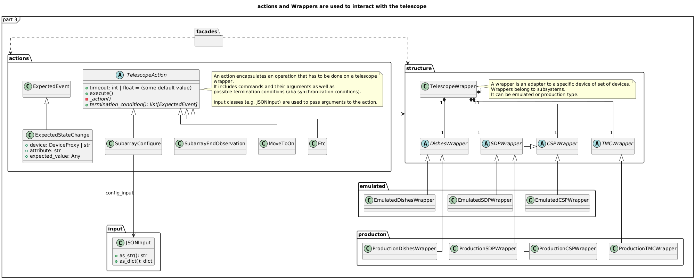

# Architecture overview of the SKA Integration Test Harness

This document provides an overview of the architecture of the SKA Integration Test Harness and the principles behind it. It is on purpose written as an
high-level document, to provide a general understanding of the design decisions
and the conventions used in the test harness, more than a detailed description
of the code.

Since the test harness is still in development, both the code and the design
may change in the future. The overall principles, however, will likely remain
the same.

This document is updated the last time on July-August 2024.

## Architecture of the test harness

This test harness is code that glues integration test scripts to the SUT. 
It is designed to provide a consistent interface for all tests,
to be **powerful** (allowing for complex tests), to be **flexible**
(extensible to meet the needs of different SUTs and different tests),
to be **easy to use** (so that tests can be written quickly),
to be **easy to maintain** (so that tests can be updated quickly)
and **reliable** (so that tests can be trusted).

For the  time being the test harness is designed to work with Tango Devices,
and specifically to support tests for integration of TMC with CSP in MID,
but it can be extended to work with other types of components.

This test harness comprises:

* **facades**, aimed at providing a consistent interface to the SUT
  so that test scripts are insulated from internal details 
* **actions**, which are the building blocks of tests and each include
  a relatively complex action that can be performed on the SUT
  (like sending a command to a device)
* **wrappers**, which wrap subsystems of the SUT and provide a structured
  interface to them and to their devices, eventually permitting the
  abstraction over some operations (e.g., operations that may differ
  between a production device and an emulator)
* **inputs**, which are used to generate and handle in a structured way
  the JSON input data for the various commands that are sent to the SUT
* **configurations**, which are used to gather configuration data or flags
  from the environment and provide a structured interface to them
* **emulators**, which are real tango devices whose behaviour is programmed
  to simulate in a very simple way the behaviour of real devices.
  The are needed to ensure that SUT is embedded in the environment
  that it expects. 
  <!--TODO: are emulators part of this test harness? -->


## RULES

### RULE 1: Tests are agnostic to the test environment

Test scripts should know as little as possible about the test environments
so that the same test, with different configurations, can be run in different
environments (like the cloud, an ITF, a PSI). 

### RULE 2: Tests are agnostic to the SUT ecosystem

Integration tests make use of emulators and simulators. In many cases test
scripts can be implemented in such a way that they do not know which devices
are real and which are emulated. In this way, the same test script can be run
with different configurations of real and emulated devices.

Of course, somewhere one needs to say that a device is emulated and what
should its behaviour be. This is done in the configuration files/flags and,
because emulated devices are de facto Tango Devices, they should be defined,
implemented and deployed prior to the execution of the test script
(and hence prior to the execution of the test harness).

In some cases it may be necessary for the test script to make assertions on
emulators (i.e. to use them as
@SPY [Spy objects as test doubles - Meszaros](http://xunitpatterns.com/Test%20Spy.html)).
In these cases such a test makes the assumption that the device is emulated.
By carefully writing assertions though, and through the use of 
[tracer objects](https://developer.skao.int/projects/ska-tango-testing/en/latest/guide/integration/index.html#tracer-objects),
it is possible to write tests that can be run with real devices and
emulators without knowing it. See below for examples.

## Architecture

")
(the source code is in `architecture-facades.plantuml` and can be updated with `java -jar plantuml.jar architecture.plantuml`)



## Conventions

The test harness files have this layout:


```plaintext
.
├── common_utils
├── emulated
├── production
├── README.md
├── actions
│   ├── central_node
│   │   ├── central_node_assign_resources.py
│   │   └── ...
│   ├── expected_event.py
│   ├── sdp_subarray
│   │   └── subarray_simulate_receive_addresses.py
│   ├── state_change_waiter.py
│   ├── subarray
│   │   ├── force_change_of_obs_state.py
│   │   ├── ...
│   ├── telescope_action.py
│   ├── telescope_action_sequence.py
│   └── utils
│       └── generate_eb_pb_ids.py
├── config
│   ├── components_config.py
│   └── ...
├── facades
│   ├── csp_facade.py
│   └── ...
├── init
│   └── telescope_structure_factory.py
├── inputs
│   ├── dict_json_input.py
│   ├── ...
└── structure
    ├── csp_devices.py
    ├── ...
```

* Facades have to be added in the `facades` folder
* Actions have to be added in the `actions` folder
* Abstract definitions of the wrappers have to be added in the 
  `structure`, while `emulated` and `production` folders contain the
  concrete implementations of the wrappers for the emulated and production
  subsystems.
* Input-related classes have to be added in the `inputs` folder
* configuration-related classes have to be added in the
  `config` folder.
* The `init` folder contains all the factories needed to initialize
  the test harness. 

## Design decisions

### Why using facades?
As mentioned above we want to insulate test scripts from the details
of the SUT. 

For example, a test that verifies that the SCAN command works as expected,
will use a facade of the TMC Central Node and a facade of the
TMC Subarray Node. These facade will provide properties of the two components
and methods to interact with them. The test script will not know that the
TMC Central Node is a Tango Device and that the TMC Subarray Node is a
Tango Device. It will not know that the TMC Central Node has a property
called `state` and that the TMC Subarray Node has a method called `scan`.
It will only know that there is a facade called `TMC` that has a property
called `central_node` and a facade called `subarray_node` that has
a method called `scan`. 

We opted for having more than just one facade, to avoid bloating a class with
too many unrelated functionalities
([Single Responsibility Principle](https://en.wikipedia.org/wiki/Single-responsibility_principle)).

Facade is a design pattern
([FACADE](https://refactoring.guru/design-patterns/facade))
that provides a simplified interface to a complex system.
In this case the complex system is the test harness itself, with the wrappers
that represent the SUT and the actions that act over the wrappers.


### Why using actions?

A test script has to interact with the SUT and send it operations to perform.
These operations are complex and require multiple steps, possibly involving
more than one component. In a distributed system like the telescope,
the operations are often asynchronous and involve multiple devices,
each evolving with its own timing.

Very frequently an operation is not just a single command, but a sequence
of commands. In these cases we often have to wait for something to happen
on some part of the SUT before starting a subsequent step. 

Actions are building blocks that encapsulate the complexity of
these operations. They are designed to be easy to use and to be powerful.
They embed both the operation to be performed and their termination condition,
that is checked within a timeout. For the time being termination conditions
can only be expressed with a list of expected tango change events.

An action can eventually be "executed", by calling the `execute` method of
the action. This method will perform the operation, wait for its termination
and return a result. The details of how to execute an action (for example,
what Tango Command to send to a device) are hidden from the test script.

The test scripts invokes a facade method called `scan()`, which instantiates
an action called `SubarrayScan`, adds to it the necessary arguments and then
calls its `execute` method. The `execute` method gathers the necessary
device proxies, sends the `scan` command to the TMC Subarray Node and waits
for the set of events listed in the action to occur.

Actions are based on the
[COMMAND](https://refactoring.guru/design-patterns/command),
[TEMPLATE METHOD](https://refactoring.guru/design-patterns/template-method) and
[COMPOSITE](https://refactoring.guru/design-patterns/composite)
design patterns. 

To implement an action, one has to extend the
`TelescopeAction` base class and override the abstract methods (to define the *procedure* that implements the action and the *synchronization condition* that defines when the action is completed).


### Why using wrappers?

Wrappers embed the parts of the SUT that the test script needs
to interact with. In the current test harness wrappers wrap Tango
Device Proxies. 
Their responsibility is to hold the details about how to interact
to such devices (i.e. names of commands, format of their input,
attribute names and values, etc.).

The main access point of the wrappers (`TelescopeWrapper`) is intended to be a [SINGLETON](https://refactoring.guru/design-patterns/singleton), so once it's initialized one time,
you can access it from everywhere in the code just by creating an instance. 
This way multiple facades and actions can share the same 
(already configured) instance of the wrappers without being aware of it
and without the need to pass it around.


### Why using JON data builder?

Some actions over the telescope (such as the *scan*, *configure*, *assign resources*, etc. commands) require an input argument that is a JSON string.
Some *reset* procedures too require default arguments to be used to call
the various commands. 

Passing these arguments around as strings or dictionaries is not a good
practice, because it makes the code more technical (full of type conversions,
explicit file reading, etc.) and so less readable. The idea of argument
factories is to provide a structured object-oriented way to represent those
arguments.

An abstract base class (`JSONInput`) defines what is expected from a JSON input (return a string or a dictionary, create a copy of itself with some
values changed, etc.). Through a concrete implementation of this class, 
one can specify how to generate this JSON (e.g., accessing your own test data folders, associating keywords to each or your specific input, 
through an hardcoded dictionary, etc.).

This solution is inspired by various creational design patterns, such as
[FACTORY METHOD](https://refactoring.guru/design-patterns/factory-method),
[ABSTRACT FACTORY](https://refactoring.guru/design-patterns/abstract-factory)
and [BUILDER](https://refactoring.guru/design-patterns/builder).

In `inputs` folder you can find some examples of JSON input classes, but also
other input-output related classes.

### Why using configuration classes?

These are mechanisms that collect configuration data from files or
runtime flags, represent them in objects, and support fixtures to setup the
proper instances of the classes that represent the structure of the SUT
and the facades.

There are a number of classes that represent the default configuration
of the structure of the SUT. For example, the class `TMCConfiguration`
contains the names of the devices that are part of the TMC. The class
`CSPConfiguration` contains the names of the devices that are part of the CSP.
The directive to use the emulated or the production devices is another
example of configuration data (very important for the initialization of the
test harness).

Since the configuration may come from different sources (environment variables,
hardcoded values, files, etc.) and since it's easy to loose track of them an
object-oriented approach is used to represent them in a structured way and
to provide a consistent interface to them. To avoid inconsistencies, a 
*factory* class (for now not abstract, but it could be) is used to create
all the instances of those configurations. This way, the test harness initialization procedure or any other part of the
code can access the same configurations.

## How to use and extend this harness

At the moment (July-August 2024) this harness has no well defined
extension points and it is pretty specific to the TMC-CSP integration tests 
in MID and - in some extent - to the TMC-X integration tests (where X may be CSP,
SDP or the Dishes), always in MID.

### How to use this test harness

To use this test harness you need to:

- Import the library `ska_integration_test_harness` in your test script.
- In your test setup, init once the wrappers using the appropriate factory
  you can find in the `init` module.
  - *A good place to do this may be a `pytest.fixture`.For how `pytest` fixtures
    work, a good way you can use to execute the *teardown* method after 
    your test are finished is to*:
    - *create an instance using the appropriate factory,*
    - *`yield` it to the test function,*
    - *and then call the `teardown` method on the instance, which will
      be executed after the test is finished.*
- The same way, init the facades you need (just creating instances of them
  and passing your wrapper instance to them).
- In your tests, use the facades methods to interact with the SUT and the
  facades properties to access directly the (already configured) device
  proxies.
  - *Remember each facade represent a subsytem, so if you want to access a
    certain device, ask yourself: which subsystem does it belong to?*
  - *Since this test harness is focused on TMC, most if not all of the actions
    are done by calling commands on TMC central node or TMC subarray node.*

### How to extend this test harness (within the current limitations)

Within the current limitations, your main ways to extend this test harness
are

- **Add new actions**: you can add new actions by subclassing the
  `TelescopeAction` class and implementing the abstract methods.
  You can also create a sequence of actions by subclassing the
  `TelescopeActionSequence` class and implementing the abstract methods.
- **Add new facades**: you can create new facades that access the telescope
  wrappers and the actions, hiding the implementation details for the tester.
- **Add new input classes**: you can create new input classes that generate
  the JSON input for the actions in your own ways (e.g., accessing your own
  test data folders, etc.).

If you wish to do more, you may copy this structure and adapt it to your needs.

### How you will be able to extend this test harness in the future

In the future, the test harness will be more flexible and will not be centered
strictly on the TMC-X integration tests in MID. Other than what is already
mentioned, you probably will be able to:

- Customize the telescope structure, choosing which subsystems to include,
  which are the targets of the actions and which are emulated or production
  ones.
  - Provide your own wrappers, if needed.
- Have more control over the initialization of the test harness, extending
  the configuration classes and the factories.
- Have more generic actions, which can be used in different contexts.
